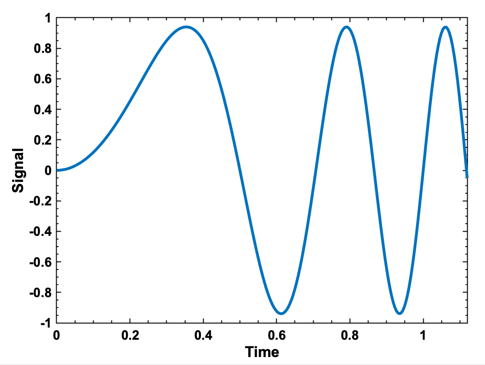

# MATLAB Utilities

## Overview

A set of small command utilities to make programming in MATLAB more productive. These utilities aren't tied to a specific field of study, and are intended to be useful for general work.

## Highlights

* A version of ls that shows the number of lines of code in each M file, with clickable links to open MATLAB-based files
* Simple MATLAB wrappers for git and svn, designed to allow some integration of version control from within the MATLAB command window.
* Plotting routines which automatically use better formatting than the default MATLAB plotting, and can use symantic knowledge of the passed variables to add axis labels (e.g. 'plot x y' will plot the variables x versus y and label the axes as such).

## Example

`>> Time = linspace(0, 1.12, 256);`

`>> Signal = sin(4*pi*Time.^2)*0.94;`

`>> myplot Time Signal`

## Notes

The addition of any similarly generally applicable tools developed by others would be a welcome addition, as I'd like to see this become a large set of general tools to be shared.
